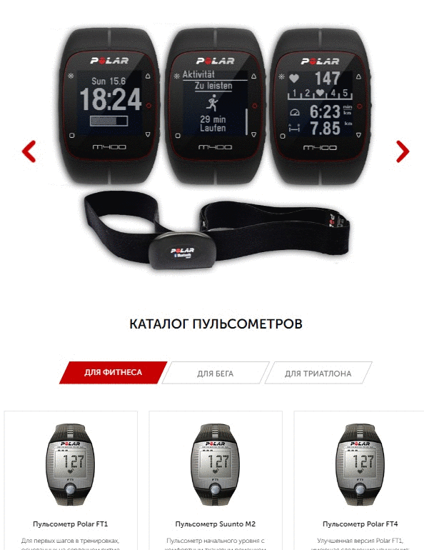
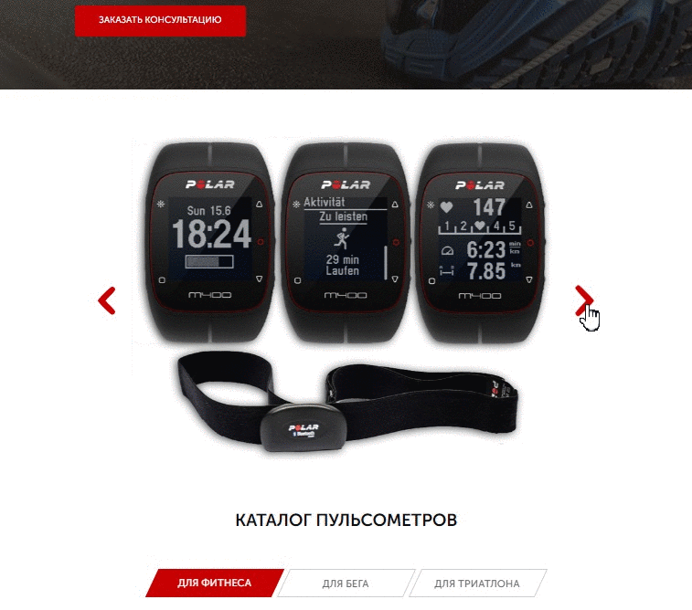
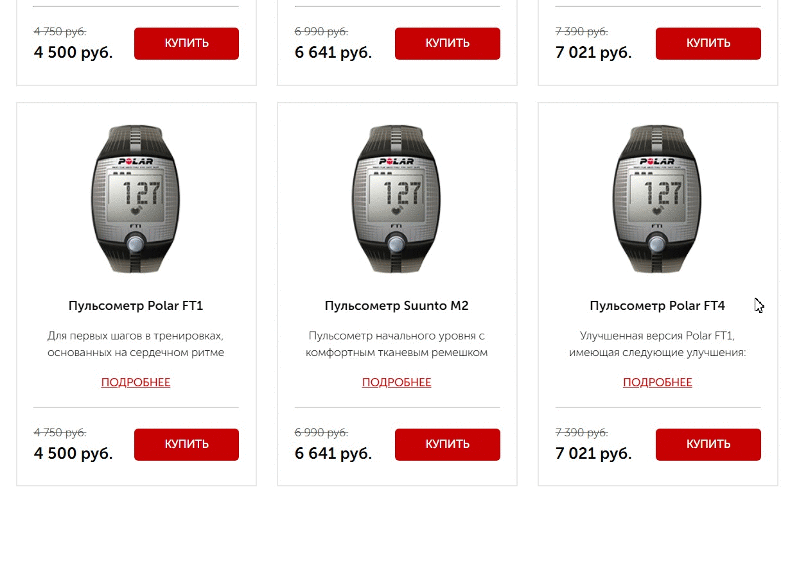
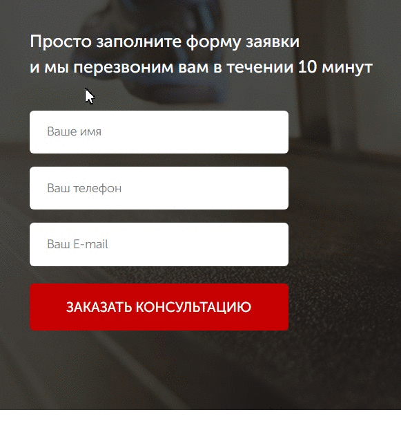
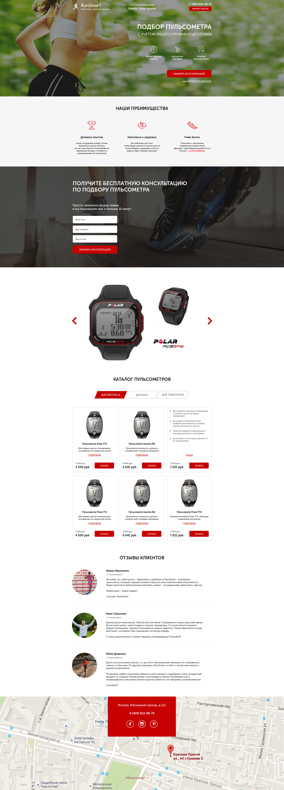

# Responsive web-design landing page with modal, forms and animations
A website project based on photoshop [layout](#layout) with responsive design to all device sizes.

## Contents

- [Experience](#experience)
- [Demo](#demo)
- [How to Use](#how-to-use)
	- [Running locally](#running-locally) 
	- [Development and testing](#development-and-testing)
- [Features and structure](#features-and-structure)
	- [Optimization](#optimization)
	- [Code flexibility and speed-up](#code-flexibility-and-speed-up)
	- [Adaptive design](#adaptive-design)
	- [Self written solutions](#self-written-solutions)
	- [Third party solutions](#third-party-solutions) 
- [Layout](#layout)

<h2 id="experience">Experience	🎓</h2>

In  this  project i practice: 
- **BEM** Methodology;
- writing in **SCSS** syntax (**pseudoclasses, pseudoelements, mixins and variables**);
- Using and configuring **GULP** task runner;
- Creating a **responsive** design without grid and mobile layout;
- Writing scripts using **JQuery**;
- Connecting interactive maps;
- Creating submission **forms and modal** windows;
- Configuring **form validation** and **masked input**;
- Using **PHPMailer** for sending forms;
- Connecting and configuring third-party interactive elements: **sliders, tabs, animations, maps**;
- Using code minification and opimization GULP plugins.

<h2 id="demo">Demo 🎥</h2>

The completed project can be viewed [here](https://gnobious.github.io/RunSmart-landing/ "demo url")

<h2 id="how-to-use">How to Use 🔧</h2>
The setup required can be broken into two types:

1. If you wish to run project locally as is 
2. If you want to see or make edits to the source code

<h3 id="running-locally"> 1. Running a project locally</h3>

If you wish to run project locally as is, then all that's required is the `dist` folder from this repository. Then just need  to open `index.html`.

<h3 id="development-and-testing"> 2. Making changes to the source code and testing</h3>

These instructions will get you a copy of the project up and running on your local machine for development and testing purposes.
#### *Prerequisites* 📋
You'll need [Git](https://git-scm.com) and [Node.js](https://nodejs.org/en/download/) (which comes with [NPM](http://npmjs.com)) installed on your computer.
Also, you can use [Yarn](https://yarnpkg.com/) instead of NPM ☝️
#### *Running* 🚀
From your command line, first clone RunSmart:

```bash
# Clone this repository
$ git clone https://github.com/gnobious/RunSmart-landing.git

# Go into the repository
$ cd RunSmart-landing

# Remove current origin repository
$ git remote remove origin
```

Then you can install the dependencies either using NPM or Yarn:

Using NPM:

```bash
# Install dependencies
$ npm install

# Start development server
$ npm start
```

Using Yarn:

```bash
# Install dependencies
$ yarn

# Start development server
$ yarn start
```

**NOTE**:
If your run into issues installing the dependencies with NPM, use this command:

```bash
# Install dependencies with all permissions
$ sudo npm install --unsafe-perm=true --allow-root
```

Once your server has started, go to this url `http://localhost:3000/` and you will see the website running on a Development Server:
                       
<h3 align="center">
  
</h3>

<h2 id="features-and-structure">Features and structure 📓</h2>
All source components are in the `src` folder. All files in `dist` was generated by gulp plugins used to optimize the project.
<h3 id="optimization">Optimization 📈</h3>

- Using **GULP** plugins for code minification and opimization :
	```js
	//gulpfile.js
	const sass =  require('gulp-sass');
	const rename =  require("gulp-rename");
	const autoprefixer =  require('gulp-autoprefixer');
	const cleanCSS =  require('gulp-clean-css');
	const imagemin =  require('gulp-imagemin');
	const htmlmin =  require('gulp-htmlmin');
	```
- `src/sass/libs/bootstrap-reboot.min.css`
	Using only a minified bootstrap library made it possible to implement site unification for browsers with minimal impact on site loading speed.
- `src/sass/libs/fonts.scss`, `fonts/` folder
	The local icon font, which contains only the elements necessary for the site, is also designed to reduce loading time and make the icon library reusable for future projects.
- `dist/css/style.min.css`
	The resulting style file `style.min.css`, is also minified by the plugins for optimization purposes.
- Minified **js** plugins and **Jquery** files were used:
	```html
	<!-- Jquery -->
	<script  src="https://code.jquery.com/jquery-1.11.0.min.js"></script>
	<!-- Slick slider script -->
	<script  src="js/slick.min.js"></script>
	<!-- Forms validation script -->
	<script  src="js/jquery.validate.min.js"></script>
	<!-- Masked Input script -->
	<script  src="js/jquery.maskedinput.min.js"></script>
	<!-- WOW.js -->
	<script  src="js/wow.min.js"></script>
	```
	
<h3 id="code-flexibility-and-speed-up">Code flexibility and work speed-up ⚡️</h3>

- The use of the CSS preprocessor, in particular SCSS, made it possible to speed up the layout and reduce the repeatability of the code.
	```bash
	├──src
		└── sass	
			├── base
			|	├── _animations.scss
			|	├── _media.scss
			|	├──	_mixins.scss
			|	└── _variables.scss
			├── blocks
			|	├── _advice.scss
			|	├── _buttons.scss
			|	├── _carousel.scss
			|	├── _catalog.scss
			|	├── _elements.scss
			|	├── _footer.scss
			|	├── _forms.scss
			|	├── _header.scss
			|	├── _modal.scss
			|	├── _pageup.scss
			|	├── _perks.scss
			|	├── _promo.scss
			|	└── _review.scss
			├── libs
			|	├── _animate.scss
			|	├── _bootstrap-reboot.min.scss
			|	├── _fonts.scss
			|	└── _slick.scss
			└── style.scss
	```

- Using the **GULP** task manager simplifies and speeds up the layout process. In particular, the plugins `gulp-sass`, `gulp-browsersync` are used for this project

<h3 id="adaptive-design">Adaptive design 📐</h3>

In this project, it was decided NOT to use ***bootstrap grid***. All adaptations are implemented using **Media Queries** and flex	


	
<h3 id="self-written-solutions">Self written solutions ✨</h3>


- Jquery tabs script

	
	
	 ```js
	 // Jquery Tabs Script
	$('ul.catalog__tabs').on('click',  'li:not(.catalog__tab_active)',  function()  {
		$(this)
			.addClass('catalog__tab_active').siblings().removeClass('catalog__tab_active')
			.closest('div.container').find('div.catalog__content').removeClass('catalog__content_active').eq($
			(this).index()).addClass('catalog__content_active');
	});
	 ```
	 	 
 - Jquery toggle slide script 
 
 	
	```js
	// Jquery Toggle Slide script
	function  toggleSlide(item)  {
		$(item).each(function(i)  {
			$(this).on('click',  function(e)  {
				e.preventDefault();
				$('.catalog-item__content').eq(i).toggleClass('catalog-item__content_active');
				$('.catalog-item__list').eq(i).toggleClass('catalog-item__list_active');
			})
		});
	};

	toggleSlide('.catalog-item__link');
	toggleSlide('.catalog-item__back');
	```
	 
 - Decorative heart animation	 
 
	
	
	```scss
	/* Img attributes scss */
	.perks
		...
		&__img {
			display: block;
			margin: 0 auto;
			margin-bottom: 38px;
			&_animated {
				animation: heartbeat 1.4s ease infinite paused;
					&:hover {
						animation-play-state: initial;
					}
			}
		}
	...
	}

	/* Heartbeat keyframes */
	@keyframes heartbeat {
		from {
			transform: scale(1);
		}
		20% {
			transform: scale(1.2);
		}
		30% {
			transform: scale(1);
		}
		60% {
			transform: scale(1.2);
		}
		70% {
			transform: scale(1);
		}
	}
	```
	
 - Modal windows called  by  data  attribute
	  	
	  
	  
	```js
	// Modal Forms
    $('[data-modal=consultation]').on('click', function() {
        $('.overlay, #consultation').fadeIn('fast');
    });
    $('.modal__close').on('click', function() {
        $('.overlay, #consultation, #order, #thanks').fadeOut('slow');
    });    

    $('.button_catalog').each(function(i) {
        $(this).on('click', function() {
            $('#order .modal__descr').text($('.catalog-item__subtitle').eq(i).text())
            $('.overlay, #order').fadeIn('fast');
        })
    });
	```
	
- Smooth page scroll-up animation script

	```js
	//Smooth Scroll and Page up button
    $(window).scroll(function(){
        if ($(this).scrollTop() > 1600) {
            $('.pageup').fadeIn();
        } else {
            $('.pageup').fadeOut();
        }
    });

    $("a[href=#up]").click(function(){
        const _href = $(this).attr("href");
        $("html, body").animate({scrollTop: $(_href).offset().top+"px"});
        return false;
    });
	```
	
<h3 id="third-party-solutions">Third-party solutions 📦</h3>
The following third-party solutions were used and adapted for the project:

- [**Slick-slider**](https://kenwheeler.github.io/slick/#getting-started)

	
- [**Animate.css**](https://animate.style) + [**WOW.js**](https://wowjs.uk)
	
	
- [**Jquery masked input**](https://github.com/digitalBush/jquery.maskedinput) & [**Jquery validate**](https://jqueryvalidation.org)

	

- [**PHP Mailer**](https://github.com/PHPMailer/PHPMailer)

	The classic email sending library for PHP

<h2 id="layout">Layout ✒️</h2>

The site layout is shown below. 
The layout in another formats is also available in the [repository](https://github.com/gnobious/RunSmart-landing/blob/master/src/references/layouts/ "layouts source").




